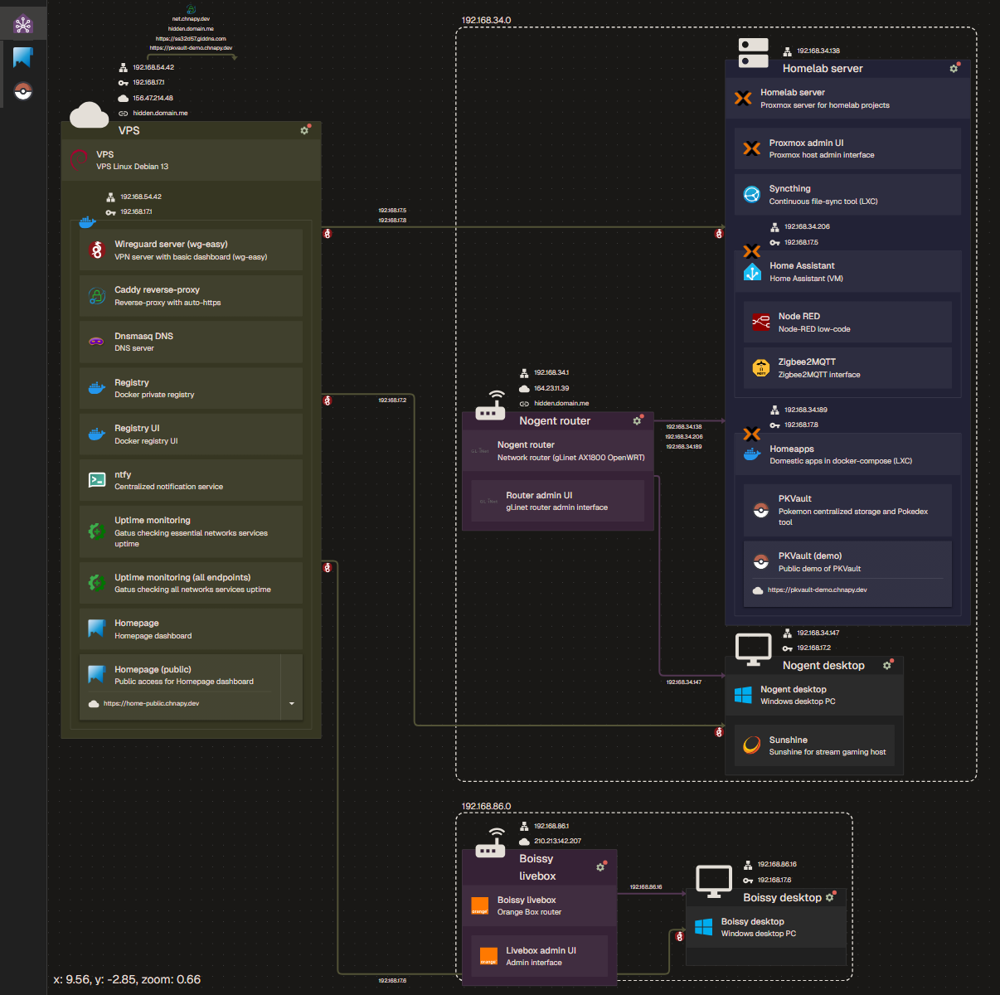

# Homenet

> Project state not ready for public use

Interactive network diagram flow-based using agents on network peers as data source.
First made for homelabs, allow to display a full network with exhaustive informations, staying up-to-date thanks to agents.

Also usable as basic frontend based on static JSON data.

Checkout public demo: https://homenet-public.chnapy.dev

    

## Features

### With agents on peers

- Extract all device informations
  - OS informations
  - All apps installed and related configs
  - All network informations
  - Docker, Proxmox, SSH, ddns, etc
- Send each day all these data to backend, keeping data up-to-date
- Also used as uptime/healthcheck

### With static data

- Tiny app - frontend only
- Read data from injected static JSON files
- Limitations: no uptime, data should be updated manually
